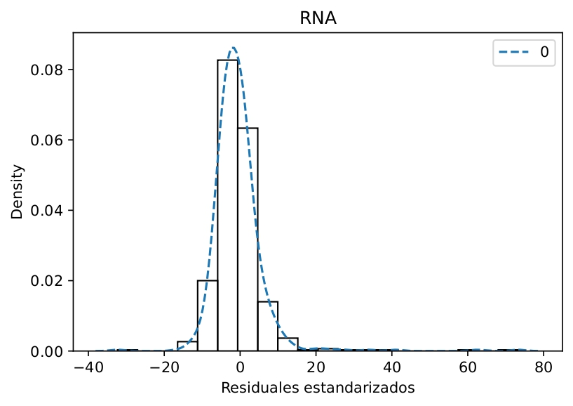

# Beta modelo hibrido Red Neuronal Artificial - Filtro de Kalman Extendido para el pronostico de concentración de PM2.5

En este repositorio encontraras un script para generar un modelo de red neuronal artificial (RNA) para pronosticar la concentración de PM2.5. La base de datos utilizada se obtuvo del Sistema Nacional de Información de la Calidad del Aire (SINAICA) de la estación CBTIS que se encuentra en la ciudad de Aguascalientes, México. El modelo de RNA es acopado al algoritmo del Filtro de Kalman Extendido para generar correciones a la salida del modelo y mejorar las estimaciones de la concentración. A continuación se describe de manera resumida la obtención, tratamiento, entrenamiento y resultados obtenidos:

## Base de datos
Para el entrenamiento del modelo de RNA se utilizaron las bases de datos del Sistema Nacional de Información sobre la Calidad del Aire (SINAICA); en especifico de la estación CBTIS que se encuentra ubicada en la ciudad de Ags, México. La base de datos es del 2022 y solo se emplearon datos temporales y de concentración de PM2.5 para el entrenamiento.

Los datos temporales se dividen en tres, hora del día ($hora \in \mathbb{Z} \cap [0-23]$), día de la semana ($dow \in \mathbb{Z} \cap [0-6]$) y día del año ($doy \in \mathbb{Z} \cap [1-365]$). Estos parámetros son variables discretas y periodicas, por lo que se aplicarion funciones seno y coseno para convertirlas a variables de tipo continuo. Esto ayuda al modelo a generar mejores pronosticos.

$$\sin(2\pi t/p)$$

$$\cos(2\pi t/p)$$

Donde $p$ define el periodo de cada variable temporal.

Los parámetros de entrada y salida fueron escalados entre [-1,1] utilizando las funciones siguientes:

$$X=2\frac{x-\min(x)}{\max(x)-\min(x)}-1$$

$$Y=2\frac{y-\min(y)}{\max(y)-\min(y)}-1$$

Donde $x$ es la matriz de datos de entrada, $X$ es la matriz de datos escalados de entrada, $y$ el vector de datos de salida y $Y$ es el vector de datos de salida escalados

## Entrenamiento del modelo
Para el diseño y entrenamiento del modelo se utilizo la libreria de Keras. Los hiperparámetros del modelo propuesto se describen a continuación

- **Topologia**: 7-100-1
- **Función de activación**: tanh (ocualtas) y lineal (salida)
- **Función perdida**: MSE
- **Épocas**: 15
- **Datos entrenamiento, validación y prueba**: 80%-10%-10%
- **Learning-rate** = 0.01
- **Optimizador**: SGD

Los parametros de entrada al modelo son las variables temporales continuas: sin(hour), cos(hour), sin(dow), cos(dow), sin(doy) y cos(doy) y el estado previo del sistema (una hora antes): PM2.5(t-1); mientras que la salida del modelo es la concentración en la hora actual: PM2.5(t).

Las metricas para medir el desempeño del modelo fueron el Error Cuadratico Medio, MSE (por sus siglas en inglés) y el coeficiente de determinación $\text{R}^2$

$$\text{R}^2=1-\frac{\displaystyle\sum_{i=1}^{N}(y_{RNA,i}-y_i)^2}{\displaystyle\sum_{i=1}^{N}(\bar{y}-y_i)^2}$$

$$\text{MSE}=\frac{1}{N}\sum_{i=1}^{N}(y_{RNA,i}-y_i)^2$$

Donde $y_{RNA,i}$ es la salida $i$ del modelo de RNA, $y_i$ es el dato real $i$, $\bar{y}$ es el promedio de todas las observaciones reales y $N$ es el número de datos observados.

## Filtro de Kalman Extendido

El algorimo de Filtro de Kalman es ampliamente usado para el seguimiento de señales y localización, navegación, control automatico, procesamiento de señales, economia y finanzas, etc. Para este analisis de procedio a utilizar la versión de Filtro de Kalman Extendido (FKE) para generar correcciones del modelo base que en este caso es un modelo de RNA feedforward. El algoritmo de FKE consta del siguiente sistema de ecuaciones y que se puede divivir en dos parte

### Predicción

$$\hat{x}_ k|_ {k-1}=f(\hat{x}_ {k-1|k-1},u_{k-1})$$

$$P_k|_ {k-1}=F_{k-1}P_{k-1|k-1}F^T_{k-1}+Q_{k-1}$$

Donde:

- $\hat{x}_{k|k-1}$ es la estimación del estado en el tiempo $k$ basada en la información del tiempo $k-1$.
- $f$ es la función de transición de estado.
- $u_{k-1}$ es la entrada en el tiempo $k-1$.
- $F_{k-1}$ es la **matriz Jacobiana** de la función de transición de estados con respecto al estado en el tiempo $k-1$.
- $P_{k-1|k-1}$ es la matriz de covarianza de la estimación del error en el tiempo $k-1$.
- $Q_{k-1}$ es la matriz de covarianza del ruido del proceso en el tiempo $k-1$

### Corrección

$$K_k=P_{k|k-1}H^T_k(H_kP_{k|k-1}H^T_k+R_k)^{-1}$$

$$\hat{x}_ {k|k}=\hat{x}_ {k|k-1}+K_k(z_k-h(\hat{x}_{k|k-1}))$$

$$P_{k|k}=(I-K_kH_k)P_{k|k-1}$$

Donde:

- $K_k$ es la ganancia del FKE.
- $H_k$ es la **matriz Jacobiana** de la función de medición en el tiempo $k$.
- $z_k$ es la medición en el tiempo $k$.
- $h$ es la función que relaciona el estado estimado con la medición.
- $R_k$ es la matriz de covarianza del ruido de medición en el tiempo $k$.
- $I$ es la matriz identidad.

## Acoplamiento del modelos

El acomplamiento del modelo de RNA con el FKE funciona de la siguiente manera. Una vez entrenado el modelo y definidos los parámetros del FKE el modelo de RNA es evaluado y la salida define como la función de transición de estados ($f$), después se calcula la matriz de covarianza del error ($P_{k|k-1}$); termina la etapa de evaluación. Despues se computa la ganancia de Kalman ($K_k$) para evaluar la corrección de la estimación $\hat{x}_{k|k}$ utilizando la salida de la RNA $\hat{x} _{k|k-1}$ y la ganancia de Kalman previamente calculada, la medición real ($z_k$) y la función que relaciona el estado estimado con la medición ($h$). Aquí hay que resaltar que la función $h$ se definio como una función identidad para este algoritmo, por lo que $h=\hat{x} _{k|k-1}$. El último paso del proceso corrección es la re evaluación de la matriz de covarianza. Por último la corrección $\hat{x} _{k|k}$ es retro alimentada como entrada al modelo de RNA. El proceso se repite N veces, donde N es el número de registros en el tiempo.

La evaluación de las matrices Jacobianas se lleva a cabo mediate la aproximación hacia adelante de una derivada numerica.

$$\frac{\partial f}{\partial \hat{x}_ {k|k-1}} \approx \frac{f(\hat{x}_{k|k-1}+\Delta x)-f(\hat{x} _{k|k-1})}{\Delta x}$$

# Resultados

## Analsis exploratorio

La base de datos original constaba de 7520 y después del filtrado 6433, elimnando un total de 1087 datos. Estos datos eran registros con concentraciones negativas, principalmente. 

Las concentraciones más altas se suelen presentar durante la mañana, alrededor de las 10:00 horas y las menores a las 16:00 horas. Aunque la mayoria de los eventos donde la concentración suele dispararse ocurren durante la madrugada; estos valores sobresalen de los valores maximos evaluados con las distancias intercuartiles. Otro detalle a resaltar es que el histograma de la concentración de PM2.5 no muestra un comportamiento normal, esto es comprobado por la prueba de Shapiro, obteniendo un p-valor = 0.0.

  
  

## Variables temporales discretas a continuas

La conversión de los parámetros temporales se muestra en las siguientes figuras. Las figuras de hora del día y día de la semana solo muestran una porcion de los datos empleados (la grafica se satura si se muestran todos) pero la figura de día del año utiliza toda la información; en ella se pueden apreciar los saltos temporales generados por el filtrado de los datos. Con este tratamiento previo de los datos el modelo no generará saltos abrutos en el tiempo una vez que se requiera repetir un periodo en el tiempo, dandole estabilidad al modelo final.

  
  
  

## Entrenamiento y evaluación del modelo RNA-FKE

La función de perdida dismuye durante el entranamiento del modelo, señalando que los parámetros se ajustaron de manera adecuada a los datos de entrenamiento, por otro lado se mantiene casi constante (ligera disminución) para los datos de evaluación, por lo que se puede descartar sobre entrenamiento del modelo.

Los resultados de la evaluación del modelo en solitario y con el FKE se muestran en la figura de la izquierda (solo una porción de los datos de prueba). Se puede apreciar que ambos modelos siguen muy de cerca a los datos de prueba pero el modelo de RNA-FKE tiene un mejor desempeño; se concluye esto por el valor obtenido de $\text{R}^2$ con respecto al modelo en solitario. Otra metrica evaluada fue el MSE, obteniendo $\text{MSE}_ {RNA}=44.92$ y $\text{MSE}_{RNA-FKE}=16.39$. Por otro lado, hay que señalar que el modelo tiene algunos problemas de osculaciones en algunos momentos

  
  

Los parámetros empleados para el FKE fueron $R_k=0.001$, $P_{k-1|k-1}=0.5$ y $Q_{k-1}=0.1$. La ganancia de Kalman y la covarianza del error durante la evaluación se muestra a continuación:

  
  

## Residuales de los datos de prueba aplicados a los modelos

La grafica de los residuales estandarizados contra la salida del modelo muestran una distrubición más uniforme cuando se emplea el FKE. La prueba de Breusch-Pagan mostro un p-valor $=1.207\times 10^{-42}$ para el modelo RNA y p-valor $=2.971\times 10^{-22}$ para el modelo RNA-FKE, estos valores aunque no son mayores al nivel de significancia ($\alpha = 0.05$), indican una mayor distribución de los residuales en el segundo modelo.

  
  

El histograma de los residuales estandarizados, de manera analoga a las Figuras anteriores, muestra una mejor distribución del error alredeor de la media cero; sin sesgo como el modelo RNA.

  
  

Por último, el algoritmo de FKE, por su naturaleza, genera un aumento en la auto correlación parcial del error, esto se puede apreciar en las graficas de la Función de Auto Correlación Parcial, PACF por sus siglas en inglés. Una auto correlación del error alta podria indicar falta de información en el modelo y por tanto bajo desempeño, pero esto no ocurre con el modelo de RNA-FKE, por lo que estos resultados son resultado indirecto de la aplicación del algoritmo y no serian un indicativo de mal desempeño del modelo.

  
  

## Distribución de las respuestas de los modelos

Por último se analiza la distribución de la salida de los modelos con respecto a los datos de prueba. Se encontró que el modelo RNA-FKE en todas las caracteristicas se acerca más a los datos reales que el modelo regular.

  

|Modelo |Media  |Desviación estandar|Oblicuidad|Curtosis|
|:-----:|:-----:|:-----------------:|:--------:|:------:|
|Real   |13.169 |8.625              |2.417     |12.567  |
|RNA    |13.812 |6.034              |0.919     |2.988   |
|RNA-FKE|13.011 |8.555              |2.738     |17.750  |

# Conclusión

El acoplamiento del algorimo de FKE a un modelo de RNA mejoró en casi el doble el desempeño del modelo. Aunque hay que señalar que el modelo hibrido no es perfecto, ya que suele presentar oscilaciones en algunas ocasiones, pero esto se puede corregir modificando los parámetros internos del FKE. Esto puede llevarse a cabo mediante alguna tecnica de busqueda de parámetros que minimice los residuales del modelo hibirido.

### Notas
- Los resultados obtenidos al correr el modelo puede variar un poco a los mostrados, ya que la semilla de números aleatoreos no está definida en el script.
- Si se va a correr el script asegurarse de modificar la ruta de lectura de la base de datos y donde
